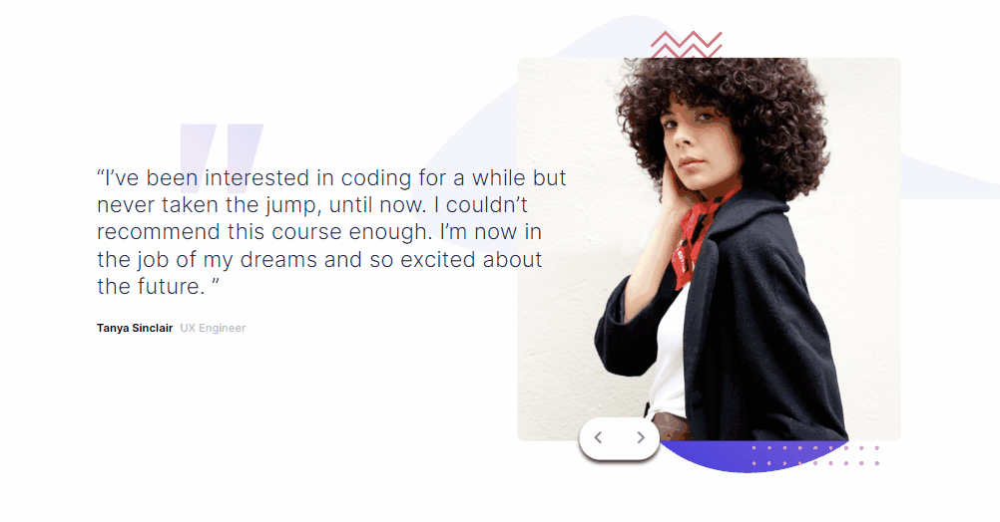

# Desafio Slider de Testimonials - Frontend-Mentor

Este é um desafio de um Slider de Testimonials proposto pelo site Frontend-Mentor.

## Tabela de Conteúdos

- [Visão Geral](#visão-geral)
    - [Imagens](#imagens)
    - [Link da página](#link)
- [Processo](#processo)
    - [Linguagens utilizadas](#linguagens-utilizadas)
    - [O que aprendi](#o-que-aprendi)
    - [Possíveis evoluções](#possíveis-evoluções)
- [Autor](#autor)

## Visão-geral

### Imagens

<br>

````
Versão de Desktop
````

   

<br>

````
Versão Mobile
````

 

### Link

- Página no GitHub Pages: <a href="https://julio-mansan2.github.io/slider-testimonials">Clique aqui!</a>

## Processo

### Linguagens utilizadas

<br>

- Marcações semânticas de HTML5
- Propriedades de customização do CSS3
- Estruturas de JavaScript

<br>

### O que aprendi

<br>

- Ocultar seções diferentes, empilhando-as:

````html

<li class="selecionada slider">
    <section class="img-mobile">
        
    </section>
    <section class="testimonial">
        <q>I’ve been interested in coding for a while but never taken the jump, until now. I couldn’t recommend this course enough. I’m now in the job of my dreams and so excited about the future. </q>
        <div>
            <p>Tanya Sinclair</p>
            <span>UX Engineer </span>
        </div>
    </section>
    <section class="img-desktop">
        
    </section>
</li>
<li class="slider">
    <section class="img-mobile">
        
    </section>
    <section class="testimonial">
        <q>If you want to lay the best foundation possible I’d recommend taking this course. The depth the instructors go into is incredible. I now feel so confident about starting up as a professional developer.</q>
        <div>
            <p>John Tarkpor</p>
            <span>Junior Front-end Developer</span>
        </div>
    </section>
    <section class="img-desktop">
        
    </section>
</li>

````

````css

.container li {
    opacity: 0;
    height: 100%;
    display: flex;
    position: absolute;
    align-items: center;
    transition: opacity 0.3s ease-in-out;
    left: 0;
}

.container .selecionada {
    opacity: 1;
    z-index: 1;
}

````

- Adicionar ou remover a classe de um elemento:

````html

<li class="selecionada slider"></li>
<li class="slider"></li>

<button>
    
</button>
<button>
    
</button>

````
````javascript

const cartaoSelecionado = document.querySelector ('.selecionada')
const sliders = document.querySelectorAll ('.slider')
const btnAvancar = document.getElementById ('btn-avancar')
const btnVoltar = document.getElementById ('btn-voltar')
let cartaoAtual = 0;

function escondercartaoSelecionado (){
    const cartaoSelecionado = document.querySelector ('.selecionada')
    cartaoSelecionado.classList.remove ('selecionada')
}

function mostrarCartao (indiceCartao){
    sliders[cartaoAtual].classList.add ('selecionada');
}

btnAvancar.addEventListener ('click', function (){
        if(cartaoAtual === sliders.length -1) return
        escondercartaoSelecionado ()
        cartaoAtual++;
        mostrarCartao (cartaoAtual)
} )

btnVoltar.addEventListener ('click', function (){
       if(cartaoAtual === 0) return        
        escondercartaoSelecionado ()
        cartaoAtual--;
        mostrarCartao (cartaoAtual)
})

````
<br>

### Possíveis evoluções

<br>

- Códigos mais compactos;
- Utilizar menor quantidade de media-querries;
- Entender melhor acerca do posicionamento de algo em "absolute";
- Aplicar backgrounds de forma correta.

<br>

## Autor

GitHub - <a href="https://github.com/julio-mansan2">julio-mansan2</a> <br>
Front-end Mentor - <a href="https://www.frontendmentor.io/profile/julio-mansan2">julio-mansan2</a> <br>
LinkedIn - <a href="https://www.linkedin.com/in/j%C3%BAlio-a-mansan-3415a7249/">Júlio A.</a> <br>